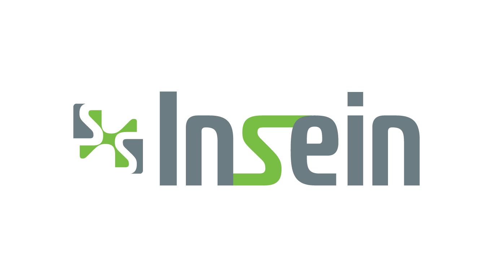

# INSEIN SRL — Sitio Web Corporativo



> **Ingeniería en Seguridad Industrial | Salud Ocupacional | Capacitación Técnica**  
> Bolivia — Servicios en todo el territorio nacional e internacionales

---

## 🏗️ Descripción del Proyecto

Sitio web corporativo de **INSEIN SRL**, empresa boliviana especializada en:
- Gestión de emergencias y reacción ante incendios industriales
- Planes de contingencia y paradas de planta
- Salud ocupacional y fisioterapia ocupacional
- Capacitaciones técnicas (señalización, electricidad, explosivos, alturas)
- Seguridad en minería — Cliente actual: Minera San Cristóbal

**Sede:** Tarija, Bolivia | **Cobertura:** Nacional e Internacional

---

## 🛠️ Stack Tecnológico

| Capa | Tecnología | Justificación |
|------|-----------|---------------|
| Estructura | HTML5 semántico | Limpio, rápido, sin overhead |
| Estilos | CSS3 + Variables nativas | Control total, sin framework pesado |
| Interactividad | Vanilla JS (ES6+) | Cero dependencias, máximo rendimiento |
| i18n | JS i18n object | Español / Inglés sin librerías externas |
| Formulario | EmailJS | Funcional sin backend |
| Deploy | GitHub Pages | Gratuito, integrado con el repo |

---

## 🎨 Sistema de Diseño

### Paleta Oficial
```css
--color-green:   #6ed60e;  /* Verde INSEIN — acento principal */
--color-steel:   #6c7f88;  /* Gris acero — color corporativo */
--color-white:   #fefefe;  /* Blanco — textos claros */
--color-dark:    #0d0f12;  /* Negro industrial — fondo */
--color-surface: #131820;  /* Superficie — cards */
```

### Tipografías
- **Display:** Barlow Condensed (headings impactantes)
- **Body:** DM Sans (legible, moderno)

---

## 📁 Estructura del Proyecto

```
insein-web/
├── index.html              ← Landing principal
├── assets/
│   ├── css/
│   │   └── styles.css      ← Estilos globales + variables
│   ├── js/
│   │   ├── main.js         ← Lógica principal, animaciones
│   │   ├── i18n.js         ← Traducciones ES/EN
│   │   └── contact.js      ← Formulario EmailJS
│   └── img/                ← Logos y assets de imagen
├── sections/               ← Documentación de secciones
├── .github/
│   └── ISSUE_TEMPLATE/     ← Plantillas de issues
├── docs/
│   └── DESIGN_SYSTEM.md    ← Guía de diseño
└── README.md
```

---

## 🚀 Metodología de Desarrollo — XP (Extreme Programming)

### Sprints
| Sprint | Contenido | Estado |
|--------|-----------|--------|
| Sprint 1 | Base, identidad visual, Hero, Nav, Footer | 🔄 En progreso |
| Sprint 2 | Servicios, Portafolio, Galería | ⏳ Pendiente |
| Sprint 3 | Nosotros, Equipo, Certificaciones | ⏳ Pendiente |
| Sprint 4 | Contacto EmailJS, WhatsApp, i18n ES/EN | ⏳ Pendiente |
| Sprint 5 | Blog, SEO, GitHub Pages, Dominio | ⏳ Pendiente |

### Principios XP aplicados
- **Iteraciones cortas** — entrega funcional en cada sprint
- **Feedback continuo** — revisión al final de cada sprint
- **Código simple** — sin sobreingeniería
- **Refactoring continuo** — mejora en cada iteración

---

## ⚙️ Instalación y Desarrollo Local

```bash
# 1. Clonar el repositorio
git clone https://github.com/CarlosQE/insein-web.git

# 2. Entrar al directorio
cd insein-web

# 3. Abrir en navegador (no requiere servidor)
# Doble click en index.html
# O usar Live Server en VS Code (recomendado)
```

### Extensiones VS Code recomendadas
- **Live Server** — recarga automática
- **Prettier** — formateo de código
- **HTML CSS Support** — autocompletado

---

## 📧 Configuración de EmailJS (Sprint 4)

1. Crear cuenta en [emailjs.com](https://www.emailjs.com)
2. Crear servicio de email con `info@inseinsrl.com`
3. Crear template de email
4. Reemplazar en `assets/js/contact.js`:
   - `YOUR_PUBLIC_KEY`
   - `YOUR_SERVICE_ID`  
   - `YOUR_TEMPLATE_ID`

---

## 🌐 Deploy en GitHub Pages

```bash
# El deploy es automático desde la rama main
# Activar en: Settings → Pages → Branch: main → / (root)
# URL resultante: https://carlosqe.github.io/insein-web/
```

---

## 📞 Contacto

**INSEIN SRL**  
📍 Tarija, Bolivia  
📧 info@inseinsrl.com  
🌐 Próximamente: www.inseinsrl.com

---

*Desarrollado con metodología XP | © 2026 INSEIN SRL*
